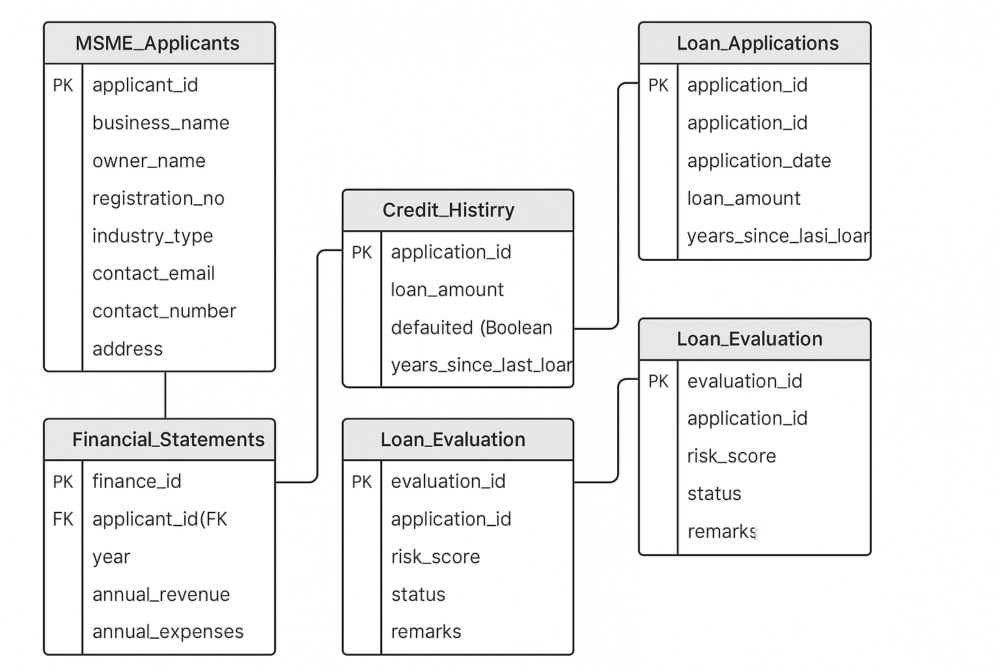

# Smart-Loan-Risk-Analysis-MSMEs
An industry-ready SQL database project for MSME loan risk analysis

---

## 🧠 Key Features

- Complete SQL schema with foreign key constraints
- Sample data for applicants, financials, credit history, and applications
- Query library for:
  - Risk scoring
  - Loan approval status
  - Industry-wise analysis
  - Historical defaulters
- Clean ER Diagram for quick understanding

---

## 🏗️ Database Tables

| Table Name           | Description                                      |
|----------------------|--------------------------------------------------|
| `MSME_Applicants`    | Stores applicant business and contact info       |
| `Financial_Statements` | Tracks revenue, expenses, and profit           |
| `Credit_History`     | Loan defaults, previous amounts                  |
| `Loan_Applications`  | Application details for new loan requests        |
| `Loan_Evaluation`    | Risk score and status for each application       |
| `Review_Logs`        | Analyst notes and reviews                        |

---

## 🖼️ ER Diagram

> Entity-Relationship Diagram (ERD) of the project:  

---

## 🔍 Sample Queries Include

- Top 5 highest-risk applicants
- Approved vs Rejected loan stats
- Industry-wise profit analysis
- List of previous defaulters
- Active applications under review
- Analyst reviews with notes

---

## 🛠️ How to Use

1. Run `schema.sql` in your SQL IDE (e.g., MySQL Workbench, pgAdmin)
2. Review the created tables and sample data
3. Run queries from `queries.sql` to explore and analyze the system

---

## 🎯 Ideal For

- Internship/placement projects (industry-ready)
- Fintech and loan risk analysis demos
- SQL & database design showcase
- Resume and GitHub portfolio

---

## 👨‍💻 Author
 
> 💼 Student Project | B.Tech CSE | 2025

---

## ⭐ Star this repo if you found it helpful!
